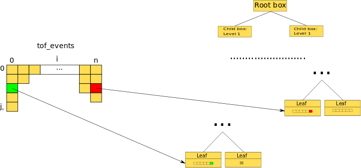
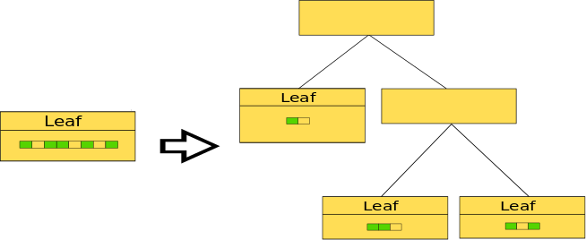
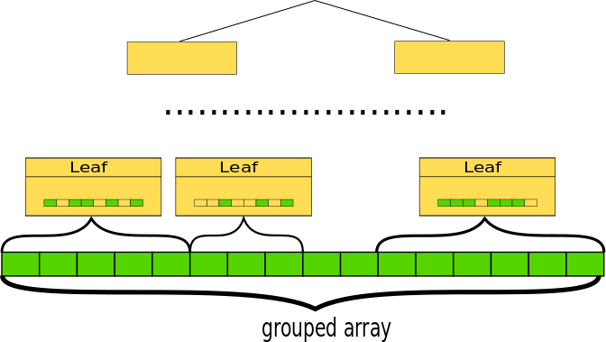
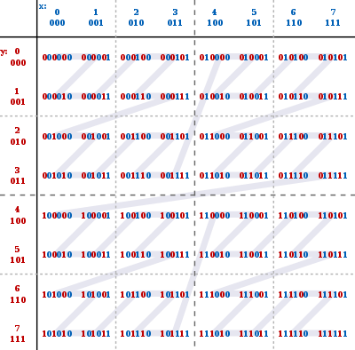
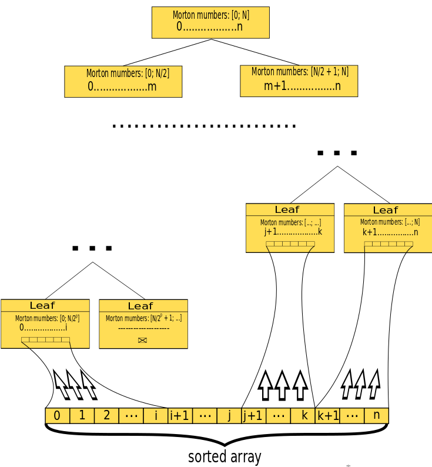

## Multidimentional workspace design

### Rationale

The idea to change the design of MD workspace grows from the slow execution of ConvertToMD algorithm and MergeMD, 
that used in various work flows. The reason of this is the way of appending events to the workspace. The two main use
cases for appending events to the workspace are: constructing the MD workspace from the existing event workspace, 
appending the number of events to existing MD workspace (merging two workspaces). Both of this cases require "bulk"
processing of multiple events. 

In current implementation we have this code to treat all cases of appending events:

``` c++
for (size_t i = 0; i < dataSize; i++) { pWs->addEvent(DataObjects::MDEvent<nd>(
     *(sigErr + 2 * i), *(sigErr + 2 * i + 1), *(runIndex + i),
     *(detId + i), (Coord + i * nd)));
}
```

```c++
TMDE(size_t MDBox)::addEvent(const MDE &Evnt) {
  std::lock_guard<std::mutex> _lock(this->m_dataMutex);
  this->data.push_back(Evnt);
  return 1;
```
Common scheme of appending events to the workspace is following:

First step (single thread): 
``` 
FOR i IN [0; n]
    FOR j IN [0; tof_events[i]]
        CONVERT_AND_ADD_TO_WORCSPACE_NODE(tof_event[i][j])
    END
END
```



Second step (multiple threads):

```
    DISTRIBUTE_EVENTS_IN_TREE 
```



The main issue is that the first step can't be effectively parallelized, because we need a random access to the leafs of 
the workspace tree. Even if we provide the thread safety through mutex (to avoid adding multiple events to the same node
with different threads at the same time) for every leaf, locks are very inefficient. 

### Proposed implementation

The natural approach to solve this issues is some kind of ordering or groupping events to have the ability to append
different groups in non blocking manner. 



For optimization of memory utilizing and cache usage the best way is to have the continuous (in terms of memory) chunks 
with events corresponding to particular box, which are not fragmented during the splitting the box. That means we have 
to introduce some mapping from Z<sup>n</sup>+ (n-dimensional positive integers, box space) to Z+ (1-dimensional positive 
integers, memory space).
 
The known way for providing such mapping is using space filling curves: the discrete coordinate of the
box on this curve become the additional 1d index for any MD event and every box contains the continuous range of this 
indexes. Then we can sort the events using index and get the continuous chunks of memory, corresponding to every box. 
The most simple space filling curve is Z-curve or Morton curve and the 1d space index is called Morton number in this
case. Due to the simplicity the Morton number can be computed very fast. 

*2D Z-curve picture from wikipedia:*




*Using this additional indexing the workspace creation could be like on this scheme:*





*And adding new portion of events:*  

 

### Changes to current implementation

In fact there are only a few things to change in the current implementation of MD workspace:
1. Add the index field in the box base class.
2. Reimplement addEvent() and addEvents() functions. 

### Drawbacks

1. Loosing the split factor (SplitInfo) as a parameter: automatically fixed as 2 for every axes of the box.
2. Limited precision of the box hierarchy (the depth of tree): N/n for N bit Morton number and n dimensions, but there
is the possibility to choose Morton number, that affects the performance.
3. Fixed global box, the initial box can't grow with adding next portion of events, the boundaries should be defined
once from instrument or sample geometry. 

### Optimization notes

The main bottleneck of the approach is memory access to MDEvent object. The best optimization for this is to make the
MDEvent object as small as possible. To reach this the floating point coordinates can be thrown out the MDEvent structure 
and retrieved then it is needed from the Morton number of the MDEvent. Also the Morton number can be chosen small enough 
to provide acceptable accuracy to increase performance. The most expensive part of both creating workspace and appending
new events is sorting, that could be also adopted for the specific data at some point.
