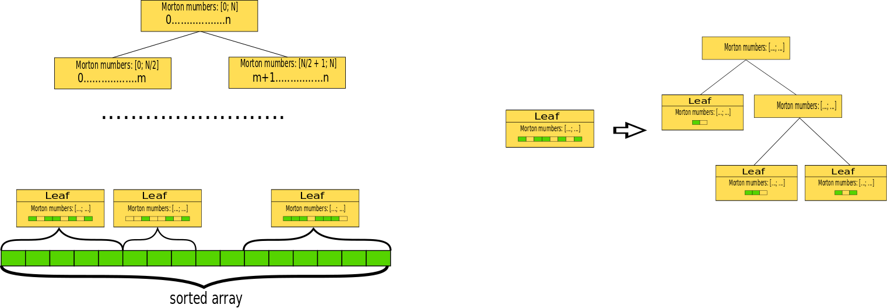

## Multidimentional workspace design

### Rationale

The idea to change the design of MD workspace grows from the slow execution of ConvertToMD algorithm, that used in
various workflows. The reason of this is the way of appending events to the workspace. The two main use cases for
appending events to the workspace are: constructing the MD workspace from the existing event workspace, appending the
number of events to existing MD workspace (merging two workspaces). Both of this cases require "bulk" processing of
multiple events. But in current implementation we have this code to treat all cases of appending events:

``` c++
for (size_t i = 0; i < dataSize; i++) { pWs->addEvent(DataObjects::MDEvent<nd>(
     *(sigErr + 2 * i), *(sigErr + 2 * i + 1), *(runIndex + i),
     *(detId + i), (Coord + i * nd)));
}
```

```c++
TMDE(size_t MDBox)::addEvent(const MDE &Evnt) {
  std::lock_guard<std::mutex> _lock(this->m_dataMutex);
  this->data.push_back(Evnt);
  return 1;
```

Here we can see two issues:
1. One by one event adding, in fact one by one pushing back in the std::vector.  
2. Locking the box during the adding of single events.

### Proposed implementation

The natural solution to solve this issues is some kind of ordering or groupping events. Due to optimizing memory
utilizing and cache usage the best way is to have the continuous in terms of memory chunks with events corresponding
to particular box. That means we have to introduce the continuous mapping from R<sup>n</sup> (box space) to R
(memory space). The known way for providing such mapping is using space filling curves: the discrete coordinate of the
box on this curve become the additional 1d index for any MD event and every box contains the continuous range of this 
indexes. Then we can sort the events using index and get the continuous chunks of memory, corresponding to every box. 
The most simple space filling curve is Z-curve or Morton curve and the 1d space index is called Morton number in this
case. 

*2D Z-curve picture from wikipedia:*


*Using this additional indexing the workspace creation could be like on this scheme:*


*And adding new portion of events:*  

 

### Drawbacks

1. Loosing the split factor as a parameter: automatically fixed as 2 for every axes of the box.
2. Limited precision of the box hierarchy (the depth of tree): N/n for N bit Morton number and n dimensions.
3. Fixed global box, the initial box can't grow with adding next portion of events, the boundaries should be defined
once from instrument  or sample geometry. 

### Optimization notes

The main bottleneck of the approach is memory access to MDEvent object. The best optimization for this is to make the
MDEvent object as small as possible. Due to this the floating point coordinates can be thrown out the MDEvent structure 
and retrieved then it is needed from the Morton number of the MDEvent. Also the Morton number can be chosen small enough 
to provide acceptable accuracy to increase performance.
