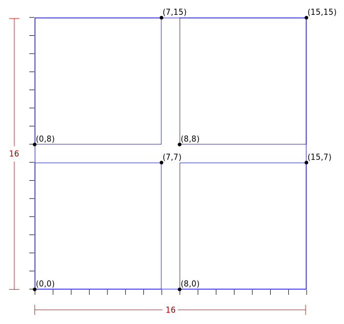

# Box Structure

A box structure is created from a Z-curve of MDEvents using a recursive
bisection method similar to that currently used in Mantid.

Boxes themselves do not hold data, rather they hold references to the start and
end of a range on the Z-curve (for simplicity this is referred to as
"containing" in this document), where the start event has the lowest Morton
number of events in the box and the end event has the highest.

## Creation

The structure is formed of boxes which contain events, and child boxes which
contain a subset of the parent's events.

The method is as follows:

1. Create a "root" box containing all events in the curve.
2. Check if the box contains fewer events than the splitting threshold or that
   the maximum tree depth has yet to be reached, exit splitting the current
   box/branch if either are satisfied.
3. Calculate the number of new child boxes (2^N) and their "width" in Morton
   number.
4. From the child widths calculate the lower and upper bounds of child boxes.
5. Iterate over box boundaries:
    1. Find the next event to NOT be contained in the current child box (1).
    2. Mark this as the end event for the current child box.
    3. Create a new child box and add it to the parent's child vector
6. For each child box:
    1. Go to step 2

Step 8 is implemented using OpenMP tasks to efficiently distribute this process
over multiple threads.

(1) "contained" here refers to spatially contained, this is evaluated true if
`box lower morton` <= `event morton` <= `box upper morton`. Note that this can
mean an event appears in two boxes if it is exactly on a boundary, however the
box splitting procedure will assign it to the lowest box in the axis/axes on
which a boundary is shared with another box.

The assumption that the dimensions of each axis are identical is made here. This
is required for the even splitting of child boxes to be valid, as splitting
happens entirely in Morton coordinates.

## Implementation notes

Boxes hold the following data:

- Lower Morton bound
- Upper Morton bound
- Event start iterator
- Event end iterator
- Child boxes (vector sorted by lower Morton bound)

Boxes do not own the events they contain. They do own their child boxes.

The upper and lower bounds of a box define the inclusive range of events that
are contained within it. When boxes are split there are effectively two
boundaries created that are adjacent to each other in integer coordinate space.
This is best demonstrated visually:



This shows a 2D MD space of size 16x16 (this refers to the MD space in
intermediate integer, not floating point coordinates) which has been split into
four 8x8 boxes.

Every event that falls within or on the boundary of a box is contained within
that box. As these are integer coordinates, floating point error and events
falling between boxes are not an issue.

## Benchmarks

Benchmarks are carried out with the box splitting threshold set to 1000 and
maximum tree depth set to 20, to mirror the current defaults in `ConvertToMD` of
Mantid.

The number of events is varied:

- 1000000
- 10000000
- 100000000
- 1000000000
- 469388241 (number of events in the large WISH dataset used for benchmarking
  against Mantid)

Command:

```bash
./src/benchmark/MDBoxBenchmark  --benchmark_min_time=10
```

Output:

```
2018-08-02 10:20:54
Running ./src/benchmark/MDBoxBenchmark
Run on (32 X 3700 MHz CPU s)
CPU Caches:
  L1 Data 32K (x16)
  L1 Instruction 32K (x16)
  L2 Unified 1024K (x16)
  L3 Unified 25344K (x2)
------------------------------------------------------------------------
Benchmark                                 Time           CPU Iterations
------------------------------------------------------------------------
BM_MDBox_fill/1000000/1000/20             3 ms          3 ms       4691
BM_MDBox_fill/10000000/1000/20           29 ms         29 ms        485
BM_MDBox_fill/100000000/1000/20         279 ms        253 ms         56
BM_MDBox_fill/1000000000/1000/20       2588 ms       2526 ms          6
BM_MDBox_fill/469388241/1000/20        1295 ms       1228 ms         11
```
