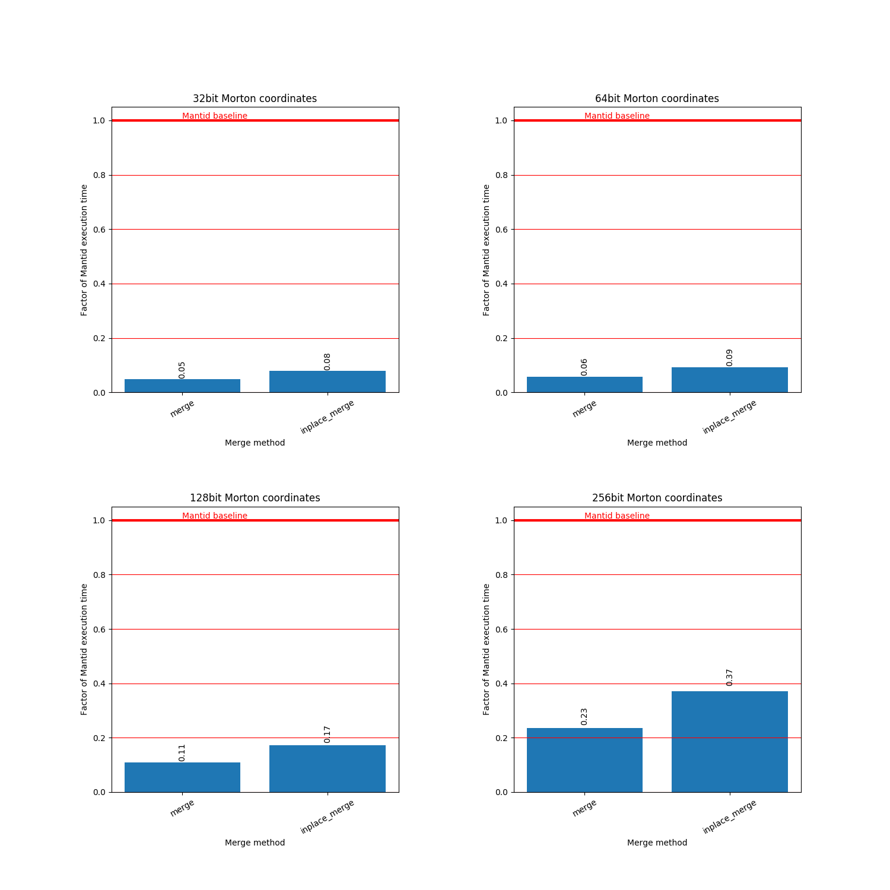

# Merging

Merging multiple MD event workspaces is possible when all worksapces to be
merged are created with the same extents in MD space. Sharing the same extents
mean that their intermediate integer coordinates (and therefore also their
Morton number coordinates) are equivalent.

Assuming two event curves with the same MD extents that are both sorted by their
Morton numbers, the operation to merge them is the merge step of a merge sorting
algorithm.

The box structures of the original curves are discarded and a new box structure
for the merged curve is then created. There is no convenient way to reuse an
existing box structure.

Merging in the prototype was implemented with both `std::merge` and
`std::inplace_merge`. In the first case the size of the two event curves being
merged must be allocated again to store the merged event curve.

In the latter case, ideally only the size of the second curve must be allocated
(this additional space is reserved in the `std::vector` holding the first
curve), additional overhead will result if the allocation causes events to be
moved in memory. For this reason it would be preferable to use the non-inplace
version if system memory allows.

## Benchmarks

The datasets used in these benchmarks are from an angular scan. The full dataset
consists of 9 datasets, only the first two are used here.

### Mantid

The Mantid benchmark consists of a single run of the `MergeMD` algorithm.

Command:
```sh
mantidpython scripts/mantid_benchmark_mergemd.py
```

Output:
```
Iteration count: 4
Total time: 142.767524719
Average time: 35.6918811798
```

### Prototype

The benchmark for the prototype is the merge operation (in this case both
`std::merge` and `std::inplace_merge` have been benchmarked) and construction of
the box structure for the merged event curve.

Command:
```sh
./src/benchmark/MergeBenchmark --benchmark_counters_tabular=true --benchmark_min_time=120
```

Output:
```
2018-10-16 14:08:21
Running ./src/benchmark/MergeBenchmark
Run on (32 X 3700 MHz CPU s)
CPU Caches:
  L1 Data 32K (x16)
  L1 Instruction 32K (x16)
  L2 Unified 1024K (x16)
  L3 Unified 25344K (x2)
-----------------------------------------------------------------------------------------------------------------------------------------------------------
Benchmark                                      Time           CPU Iterations box_structure md_events_curve_1 md_events_curve_2 md_events_merged      merge
-----------------------------------------------------------------------------------------------------------------------------------------------------------
BM_Merge_Inplace<uint8_t, uint32_t>         2795 ms       2206 ms         74      0.906215          54.4595M          54.5258M         108.985M    1.81097
BM_Merge_Inplace<uint16_t, uint64_t>        3294 ms       2740 ms         59      0.839959          54.4595M          54.5258M         108.985M    2.37391
BM_Merge_Inplace<uint32_t, uint128_t>       6134 ms       5052 ms         32       1.54043          54.4595M          54.5258M         108.985M    4.48064
BM_Merge_Inplace<uint64_t, uint256_t>      13240 ms      11099 ms         16       3.57254          54.4595M          54.5258M         108.985M    9.41988
BM_Merge_New<uint8_t, uint32_t>             1744 ms       1049 ms        123      0.916478          54.4595M          54.5258M         108.985M   0.751099
BM_Merge_New<uint16_t, uint64_t>            2058 ms       1426 ms        121      0.900056          54.4595M          54.5258M         108.985M     1.0694
BM_Merge_New<uint32_t, uint128_t>           3856 ms       2797 ms         58       1.65581          54.4595M          54.5258M         108.985M     2.0521
BM_Merge_New<uint64_t, uint256_t>           8372 ms       5727 ms         30       3.88727          54.4595M          54.5258M         108.985M    4.21182
```

### Results

The plot below visualises the speedup in merging two workspaces.


