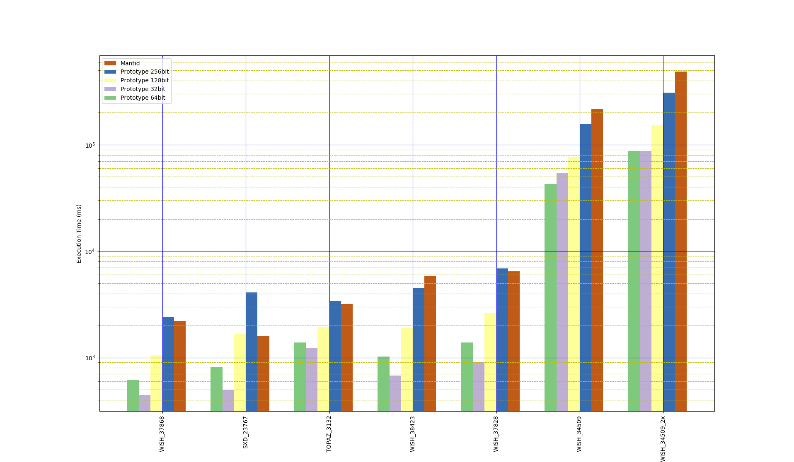

# Q-space conversion

A simple conversion to Q-space for the elastic case is implemented in
`EventToMDEventConversion.[h,cpp]`.

## Usage

To simplify implementation a Python script is used to convert instrument
definition files to a basic HDF5 format containing the instrument geometry. This
conversion is performed using:
```
./get_geometry.py WISH_Definition_10Panels.xml wish.nxs
```

The `QConversionDemo` is used to perform the conversion, currently it simply
performs the conversion and saves the Q-space coordinates obtained from a
conversion back from the interleaved coordinates. It can be run using:
```
./QConversionDemo -data WISH00034509.nxs -frames all -instrument wish.h5
```

## Benchmark

A Q conversion benchmark has been implemented for the following instruments and
datasets:

- WISH, 34509 (V/Nb rod)
- WISH, 34509 (V/Nb rod), with double the original event count
- WISH, 37828 (hexaferrite 300K 0T)
- WISH, 37868 (hexaferrite 20K 0.4T)
- WISH, 38423 (NaCl)
- TOPAZ, 3132 (triphylite)
- SXD, 23767 (NaCl sphere)

The times taken for each stage of the workflow (Q conversion, MD event sorting,
box structure construction) are reported individually in seconds. The number of
MD events created is also reported.

### Prototype

Command:
```bash
./src/benchmark/QConversionBenchmark --benchmark_counters_tabular=true --benchmark_min_time=300
```

Output:
```
2018-08-23 08:18:26
Running ./src/benchmark/QConversionBenchmark
Run on (32 X 3700 MHz CPU s)
CPU Caches:
  L1 Data 32K (x16)
  L1 Instruction 32K (x16)
  L2 Unified 1024K (x16)
  L3 Unified 25344K (x2)
------------------------------------------------------------------------------------------------------------------------------------------
Benchmark                                                  Time           CPU Iterations box_structure  md_events q_conversion       sort
------------------------------------------------------------------------------------------------------------------------------------------
BM_QConversion_WISH_34509<uint16_t, uint64_t>          48130 ms       7461 ms         25       12.7169   469.388M      30.4936     4.2343
BM_QConversion_WISH_34509<uint32_t, uint128_t>         74236 ms      11534 ms         10       25.6299   469.388M      37.0523    10.6647
BM_QConversion_WISH_34509_2x<uint16_t, uint64_t>       84967 ms      13443 ms         13         24.85   938.776M      50.3328    8.53741
BM_QConversion_WISH_34509_2x<uint32_t, uint128_t>     151640 ms      23313 ms          8       61.2421   938.776M      71.8354    16.7043
BM_QConversion_WISH_38423<uint16_t, uint64_t>           1089 ms        600 ms        290      0.318792   15.1266M     0.637013  0.0962045
BM_QConversion_WISH_38423<uint32_t, uint128_t>          1995 ms        812 ms        206      0.810601   15.1266M     0.949199   0.188244
BM_QConversion_WISH_37828<uint16_t, uint64_t>           1461 ms        700 ms        229      0.478626   21.5551M     0.801098   0.135775
BM_QConversion_WISH_37828<uint32_t, uint128_t>          2747 ms        937 ms        185       1.15113   21.5551M       1.2623   0.270921
BM_QConversion_WISH_37868<uint16_t, uint64_t>            621 ms        414 ms        395      0.137485   7.12883M     0.414525  0.0489385
BM_QConversion_WISH_37868<uint32_t, uint128_t>          1041 ms        500 ms        347      0.367568   7.12883M     0.565563  0.0822997
BM_QConversion_TOPAZ_3132<uint16_t, uint64_t>           1391 ms       1069 ms        158      0.217483    9.0473M      1.07949  0.0643299
BM_QConversion_TOPAZ_3132<uint32_t, uint128_t>          1921 ms       1164 ms        142      0.504137    9.0473M       1.2653   0.113824
BM_QConversion_SXD_23767<uint16_t, uint64_t>             825 ms        393 ms        435      0.274257   14.3206M      0.43106  0.0880714
BM_QConversion_SXD_23767<uint32_t, uint128_t>           1706 ms        570 ms        299      0.753159   14.3206M     0.735778   0.174364
```

### Mantid

A benchmark for the equivalent operations using the `ConvertToMD` algorithm in
Mantid was implemented in `mantid_benchmark.py`, essentially this just times the
execution of `ConvertToMD`.

Command:
```bash
mantidpython mantid_benchmark.py
```

Output:
```
Data file: /media/scratch/md_data/WISH00034509.nxs
Iteration count: 2
Total time: 429.640670776
Average time: 214.820335388

Data file: /media/scratch/md_data/WISH00034509_2x_larger.nxs
Iteration count: 1
Total time: 486.264434814
Average time: 486.264434814

Data file: /media/scratch/md_data/WISH00037828_event.nxs
Iteration count: 47
Total time: 303.21591568
Average time: 6.45140246128

Data file: /media/scratch/md_data/WISH00037868_event.nxs
Iteration count: 136
Total time: 301.001451015
Average time: 2.21324596335

Data file: /media/scratch/md_data/WISH00038423_event.nxs
Iteration count: 52
Total time: 302.077934742
Average time: 5.80919105273

Data file: /media/scratch/md_data/TOPAZ_3132_event.nxs
Iteration count: 95
Total time: 302.611093521
Average time: 3.1853799318

Data file: /media/scratch/md_data/SXD23767_event.nxs
Iteration count: 190
Total time: 300.900251627
Average time: 1.58368553488
```

### Comparison

The plot below shows the benchmark results (ordered by 128bit prototype
execution time), note the logarithmic time axis.


