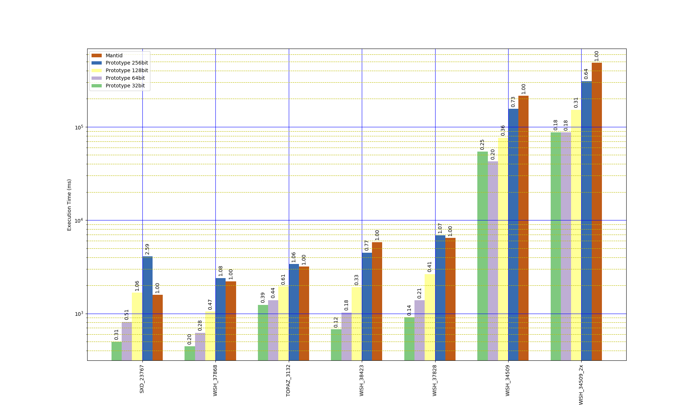

# Q-space conversion

A simple conversion to Q-space for the elastic case is implemented in
`EventToMDEventConversion.[h,cpp]`.

## Usage

To simplify implementation a Python script is used to convert instrument
definition files to a basic HDF5 format containing the instrument geometry. This
conversion is performed using:
```
./get_geometry.py WISH_Definition_10Panels.xml wish.nxs
```

The `QConversionDemo` is used to perform the conversion, currently it simply
performs the conversion and saves the Q-space coordinates obtained from a
conversion back from the interleaved coordinates. It can be run using:
```
./QConversionDemo -data WISH00034509.nxs -frames all -instrument wish.h5
```

## Benchmark

A Q conversion benchmark has been implemented for the following instruments and
datasets:

- WISH, 34509 (V/Nb rod)
- WISH, 34509 (V/Nb rod), with double the original event count
- WISH, 37828 (hexaferrite 300K 0T)
- WISH, 37868 (hexaferrite 20K 0.4T)
- WISH, 38423 (NaCl)
- TOPAZ, 3132 (triphylite)
- SXD, 23767 (NaCl sphere)

The times taken for each stage of the workflow (Q conversion, MD event sorting,
box structure construction) are reported individually in seconds. The number of
MD events created is also reported.

### Prototype

Command:
```bash
./src/benchmark/QConversionBenchmark --benchmark_counters_tabular=true --benchmark_min_time=300
```

Output:
```
2018-09-07 09:15:32
Running ./src/benchmark/QConversionBenchmark
Run on (32 X 3700 MHz CPU s)
CPU Caches:
  L1 Data 32K (x16)
  L1 Instruction 32K (x16)
  L2 Unified 1024K (x16)
  L3 Unified 25344K (x2)
------------------------------------------------------------------------------------------------------------------------------------------
Benchmark                                                  Time           CPU Iterations box_structure  md_events q_conversion       sort
------------------------------------------------------------------------------------------------------------------------------------------
BM_QConversion_WISH_34509<uint8_t, uint32_t>           54290 ms       5100 ms        134       7.74917   469.388M      44.0332    1.78158
BM_QConversion_WISH_34509<uint16_t, uint64_t>          42710 ms       7412 ms        119        12.012   469.388M      25.8097    4.18067
BM_QConversion_WISH_34509<uint32_t, uint128_t>         76505 ms      13129 ms         74       29.3902   469.388M      37.2557    8.85433
BM_QConversion_WISH_34509<uint64_t, uint256_t>        155937 ms      27939 ms         35       77.7357   469.388M      60.2583    16.2917
BM_QConversion_WISH_34509_2x<uint8_t, uint32_t>        87575 ms       9697 ms         91       15.9132   938.776M      66.4573    3.72813
BM_QConversion_WISH_34509_2x<uint16_t, uint64_t>       87186 ms      14488 ms         56       29.4277   938.776M      47.2738    8.94684
BM_QConversion_WISH_34509_2x<uint32_t, uint128_t>     152652 ms      26680 ms         32       63.5278   938.776M      70.7808    16.2892
BM_QConversion_WISH_34509_2x<uint64_t, uint256_t>     309423 ms     111975 ms         11       154.378   938.776M      119.956     32.458
BM_QConversion_WISH_38423<uint8_t, uint32_t>             676 ms        444 ms       1902       0.16447   15.1266M     0.428759  0.0604724
BM_QConversion_WISH_38423<uint16_t, uint64_t>           1024 ms        546 ms       1551      0.305405   15.1266M     0.590429     0.1016
BM_QConversion_WISH_38423<uint32_t, uint128_t>          1917 ms        750 ms       1126      0.797096   15.1266M       0.8988   0.184287
BM_QConversion_WISH_38423<uint64_t, uint256_t>          4495 ms       1238 ms        711       2.39661   15.1266M      1.67321    0.37245
BM_QConversion_WISH_37828<uint8_t, uint32_t>             911 ms        523 ms       1621      0.254508   21.5551M     0.548894  0.0769294
BM_QConversion_WISH_37828<uint16_t, uint64_t>           1383 ms        647 ms       1322      0.428129   21.5551M     0.775506   0.143844
BM_QConversion_WISH_37828<uint32_t, uint128_t>          2646 ms        912 ms        868       1.10838   21.5551M      1.22068   0.271042
BM_QConversion_WISH_37828<uint64_t, uint256_t>          6897 ms       1371 ms        643       3.26455   21.5551M      2.99088   0.574269
BM_QConversion_WISH_37868<uint8_t, uint32_t>             445 ms        346 ms       2430     0.0747615   7.12883M     0.319725  0.0365689
BM_QConversion_WISH_37868<uint16_t, uint64_t>            602 ms        397 ms       2126      0.142938   7.12883M     0.391129   0.052382
BM_QConversion_WISH_37868<uint32_t, uint128_t>          1047 ms        510 ms       1680      0.387877   7.12883M     0.553058  0.0864097
BM_QConversion_WISH_37868<uint64_t, uint256_t>          2399 ms        601 ms       1333       1.08678   7.12883M      1.11325   0.170448
BM_QConversion_TOPAZ_3132<uint8_t, uint32_t>            1239 ms       1038 ms        868      0.139032    9.0473M      1.02354   0.054263
BM_QConversion_TOPAZ_3132<uint16_t, uint64_t>           1388 ms       1048 ms        790      0.219784    9.0473M      1.07745  0.0661694
BM_QConversion_TOPAZ_3132<uint32_t, uint128_t>          1942 ms       1193 ms        700      0.514687    9.0473M       1.2817   0.115007
BM_QConversion_TOPAZ_3132<uint64_t, uint256_t>          3391 ms       1405 ms        593       1.38127    9.0473M      1.74924   0.220363
BM_QConversion_SXD_23767<uint8_t, uint32_t>              497 ms        281 ms       2980      0.142586   14.3206M     0.270753  0.0591994
BM_QConversion_SXD_23767<uint16_t, uint64_t>             812 ms        375 ms       2269      0.272478   14.3206M     0.418178  0.0932486
BM_QConversion_SXD_23767<uint32_t, uint128_t>           1674 ms        563 ms       1503      0.748064   14.3206M     0.713701   0.174947
BM_QConversion_SXD_23767<uint64_t, uint256_t>           4107 ms       1097 ms        756       2.26912   14.3206M      1.43561    0.35243
```

### Mantid

A benchmark for the equivalent operations using the `ConvertToMD` algorithm in
Mantid was implemented in `mantid_benchmark.py`, essentially this just times the
execution of `ConvertToMD`.

Command:
```bash
mantidpython mantid_benchmark.py
```

Output:
```
Data file: /media/scratch/md_data/WISH00034509.nxs
Iteration count: 2
Total time: 429.640670776
Average time: 214.820335388

Data file: /media/scratch/md_data/WISH00034509_2x_larger.nxs
Iteration count: 1
Total time: 486.264434814
Average time: 486.264434814

Data file: /media/scratch/md_data/WISH00037828_event.nxs
Iteration count: 47
Total time: 303.21591568
Average time: 6.45140246128

Data file: /media/scratch/md_data/WISH00037868_event.nxs
Iteration count: 136
Total time: 301.001451015
Average time: 2.21324596335

Data file: /media/scratch/md_data/WISH00038423_event.nxs
Iteration count: 52
Total time: 302.077934742
Average time: 5.80919105273

Data file: /media/scratch/md_data/TOPAZ_3132_event.nxs
Iteration count: 95
Total time: 302.611093521
Average time: 3.1853799318

Data file: /media/scratch/md_data/SXD23767_event.nxs
Iteration count: 190
Total time: 300.900251627
Average time: 1.58368553488
```

### Comparison

The plot below shows the benchmark results (ordered by 128bit prototype
execution time), note the logarithmic time axis.


