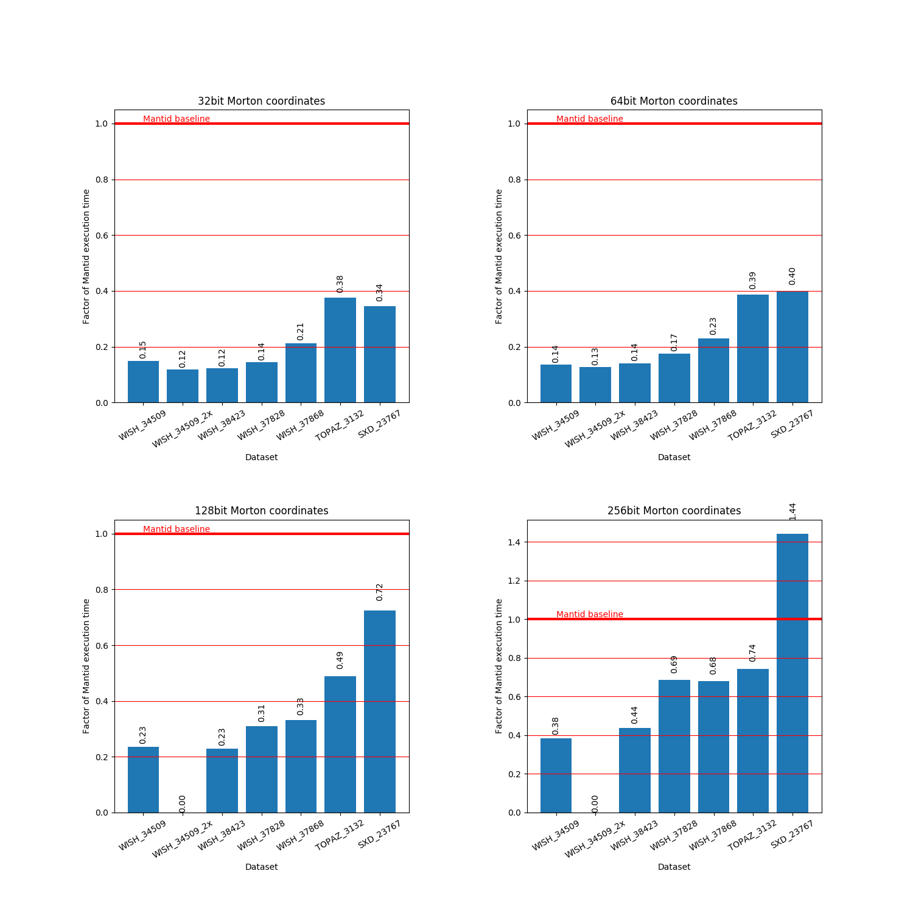

# Q-space conversion

A simple conversion to Q-space for the elastic case is implemented in
`EventToMDEventConversion.[h,cpp]`.

## Usage

To simplify implementation a Python script is used to convert instrument
definition files to a basic HDF5 format containing the instrument geometry. This
conversion is performed using:
```
./get_geometry.py WISH_Definition_10Panels.xml wish.nxs
```

The `QConversionDemo` is used to perform the conversion, currently it simply
performs the conversion and saves the Q-space coordinates obtained from a
conversion back from the interleaved coordinates. It can be run using:
```
./QConversionDemo -data WISH00034509.nxs -frames all -instrument wish.h5
```

## Benchmark

A Q conversion benchmark has been implemented for the following instruments and
datasets:

- WISH, 34509 (V/Nb rod)
- WISH, 34509 (V/Nb rod), with double the original event count
- WISH, 37828 (hexaferrite 300K 0T)
- WISH, 37868 (hexaferrite 20K 0.4T)
- WISH, 38423 (NaCl)
- TOPAZ, 3132 (triphylite)
- SXD, 23767 (NaCl sphere)

The times taken for each stage of the workflow (Q conversion, MD event sorting,
box structure construction) are reported individually in seconds. The number of
MD events created is also reported.

### Prototype

Command:
```bash
./src/benchmark/QConversionBenchmark --benchmark_counters_tabular=true --benchmark_min_time=300
```

Output:
```
2018-10-09 08:03:16
Running ./src/benchmark/QConversionBenchmark
Run on (32 X 3700 MHz CPU s)
CPU Caches:
  L1 Data 32K (x16)
  L1 Instruction 32K (x16)
  L2 Unified 1024K (x16)
  L3 Unified 25344K (x2)
------------------------------------------------------------------------------------------------------------------------------------------
Benchmark                                                  Time           CPU Iterations box_structure  md_events q_conversion       sort
------------------------------------------------------------------------------------------------------------------------------------------
BM_QConversion_WISH_34509<uint8_t, uint32_t>           32200 ms       6114 ms         73       2.98769   469.388M      25.4477    3.04548
BM_QConversion_WISH_34509<uint16_t, uint64_t>          29133 ms       6723 ms         63       2.76884   469.388M      21.7716    4.01904
BM_QConversion_WISH_34509<uint32_t, uint128_t>         50431 ms      12701 ms         35       5.26724   469.388M      35.8828    8.33276
BM_QConversion_WISH_34509<uint64_t, uint256_t>         82654 ms      24299 ms         17       11.9981   469.388M      54.5944    14.5353
BM_QConversion_WISH_34509_2x<uint8_t, uint32_t>        57877 ms      13157 ms         34       6.52425   938.776M      44.1092    5.91394
BM_QConversion_WISH_34509_2x<uint8_t, uint32_t>        57877 ms      13157 ms         34       6.52425   938.776M      44.1092    5.91394
BM_QConversion_WISH_34509_2x<uint16_t, uint64_t>       61581 ms      14864 ms         31       6.29518   938.776M      44.9318    9.06666
BM_QConversion_WISH_38423<uint8_t, uint32_t>             717 ms        512 ms        824      0.078021   15.1266M     0.524756  0.0826168
BM_QConversion_WISH_38423<uint16_t, uint64_t>            820 ms        550 ms        768     0.0842037   15.1266M      0.60075   0.101693
BM_QConversion_WISH_38423<uint32_t, uint128_t>          1327 ms        752 ms        562      0.154622   15.1266M      0.93892   0.187037
BM_QConversion_WISH_38423<uint64_t, uint256_t>          2535 ms       1158 ms        358      0.364036   15.1266M      1.67942   0.418412
BM_QConversion_WISH_37828<uint8_t, uint32_t>             930 ms        612 ms        690      0.120148   21.5551M     0.660188   0.107024
BM_QConversion_WISH_37828<uint16_t, uint64_t>           1127 ms        626 ms        627      0.124009   21.5551M     0.792893   0.160807
BM_QConversion_WISH_37828<uint32_t, uint128_t>          2003 ms        886 ms        617      0.227749   21.5551M       1.3907   0.312825
BM_QConversion_WISH_37828<uint64_t, uint256_t>          4432 ms       1314 ms        326      0.533185   21.5551M      3.14018   0.653433
BM_QConversion_WISH_37868<uint8_t, uint32_t>             468 ms        378 ms       1133     0.0397815   7.12883M     0.368161  0.0419735
BM_QConversion_WISH_37868<uint16_t, uint64_t>            510 ms        391 ms       1079      0.041351   7.12883M     0.399068  0.0494611
BM_QConversion_WISH_37868<uint32_t, uint128_t>           736 ms        497 ms        833     0.0742355   7.12883M     0.551093  0.0865578
BM_QConversion_WISH_37868<uint64_t, uint256_t>          1507 ms        598 ms        704      0.172117   7.12883M      1.11825   0.180337
BM_QConversion_TOPAZ_3132<uint8_t, uint32_t>            1195 ms       1020 ms        405     0.0965949    9.0473M     0.996575  0.0730942
BM_QConversion_TOPAZ_3132<uint16_t, uint64_t>           1232 ms       1060 ms        392     0.0838561    9.0473M      1.05398  0.0646486
BM_QConversion_TOPAZ_3132<uint32_t, uint128_t>          1559 ms       1148 ms        364      0.155109    9.0473M       1.2489   0.117034
BM_QConversion_TOPAZ_3132<uint64_t, uint256_t>          2371 ms       1342 ms        308      0.357828    9.0473M      1.72075   0.240981
BM_QConversion_SXD_23767<uint8_t, uint32_t>              546 ms        340 ms       1252     0.0938787   14.3206M     0.346239  0.0755479
BM_QConversion_SXD_23767<uint16_t, uint64_t>             635 ms        385 ms       1094     0.0935149   14.3206M     0.418179  0.0909463
BM_QConversion_SXD_23767<uint32_t, uint128_t>           1146 ms        558 ms        722      0.183784   14.3206M     0.743254   0.174898
BM_QConversion_SXD_23767<uint64_t, uint256_t>           2286 ms       1031 ms        405      0.443318   14.3206M      1.40323   0.369899
```

### Mantid

A benchmark for the equivalent operations using the `ConvertToMD` algorithm in
Mantid was implemented in `mantid_benchmark.py`, essentially this just times the
execution of `ConvertToMD`.

Command:
```bash
mantidpython scripts/mantid_benchmark_converttomd.py
```

Output:
```
Data file: /media/scratch/md_data/WISH00034509.nxs
Iteration count: 2
Total time: 429.640670776
Average time: 214.820335388

Data file: /media/scratch/md_data/WISH00034509_2x_larger.nxs
Iteration count: 1
Total time: 486.264434814
Average time: 486.264434814

Data file: /media/scratch/md_data/WISH00037828_event.nxs
Iteration count: 47
Total time: 303.21591568
Average time: 6.45140246128

Data file: /media/scratch/md_data/WISH00037868_event.nxs
Iteration count: 136
Total time: 301.001451015
Average time: 2.21324596335

Data file: /media/scratch/md_data/WISH00038423_event.nxs
Iteration count: 52
Total time: 302.077934742
Average time: 5.80919105273

Data file: /media/scratch/md_data/TOPAZ_3132_event.nxs
Iteration count: 95
Total time: 302.611093521
Average time: 3.1853799318

Data file: /media/scratch/md_data/SXD23767_event.nxs
Iteration count: 190
Total time: 300.900251627
Average time: 1.58368553488
```

### Comparison

The plot below shows the benchmark results (ordered by Mantid execution time),
note the logarithmic time axis. The time for each variant of the prototype is
shown as a factor of the Mantid execution time at the top of each bar.


